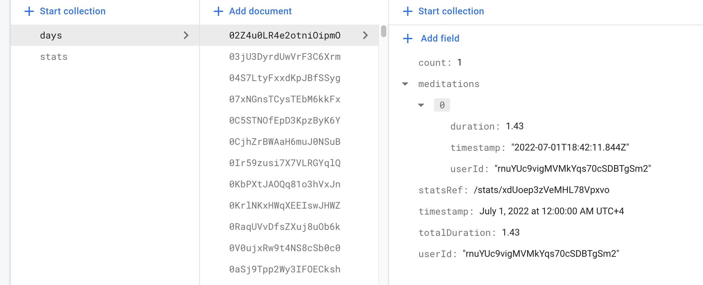
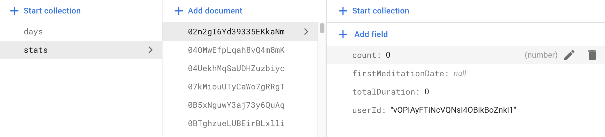

# Pokoy

A meditation app for impulsive minds.

This is a timer for meditation. In more complicated terms it reverse timer that is built on progressively longer stretches of time to reinforce the meditations and keep statistics.

## Screenshots

<!--  -->

## Stack

- React + Redux Toolkit + TypeScript
- Firebase with Firestore

## Development

1. Create a personal Firestore with following collections and documents' structures
  - 
  - 
2. Get Firebase API key
3. Create file **.env.local** with variable `REACT_APP_FIREBASE_API_KEYS`
4. Run `yarn && yarn start`

## Features

- Completely ad-free and open source. There are no advertisements, annoying notifications or intrusive permissions in this app, and there will never be. The app is completely open-source.

- Works offline and respects your privacy. Pokoy doesn't require an Internet connection or online account registration. Your confidential data is never sent to anyone. Neither the developers nor any third-parties have access to it.

* [x] easier concept description
* [x] stronger concept description
* [x] loging in
* [x] statistics
* [x] auto updates
* [x] visualisation of statistics
* [x] onboarding

## Contributing

Loop is an open source project developed entirely by volunteers. If you would like to contribute to the project, you are very welcome. There are many ways to contribute, even if you are not a software developer.

Report bugs, suggest features. The easiest way to contribute is to simply use the app and let us know if you find any problems or have any suggestions to improve it. To report a problem, please create a new bug report. To request a new feature or vote on existing feature requests, please visit our GitHub Discussions page. If you would like to receive the newest versions of the app earlier than everyone else, join our open beta on Google Play.

Spread the word. If you like the app, share it with your family, friends and colleagues. You can also rate and review the app on Google Play Store, to help other users find it more easily.

Translate the app into your own language. If you are not a native English speaker, and would like to see the app translated into your own language, please join our open translation project. If the translation is already completed, you are also very welcome to join and proofread it.

Write some code. If you are an Android developer, you are very welcome to contribute with code. Please see the guidelines.

## Usage

Just visit https://pokoy.app and play! Can be installed to homescreen as PWA
